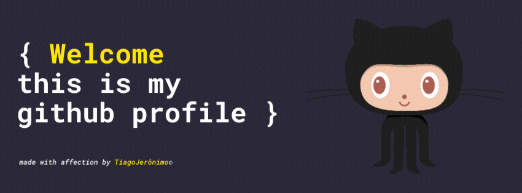

  <h1><strong>Hello, world! 👋 I'm Tiago Jerônimo </strong></h1>

💡 Software development, Liturgy and reading.
  
🔭 I'm currently studying to become a Full Stack Junior, see my progress in this [repository](https://github.com/tiago-jeronimo/trybe.exercicios)  
 

  <a href="https://github.com/tiago-jeronimo">
    
     

