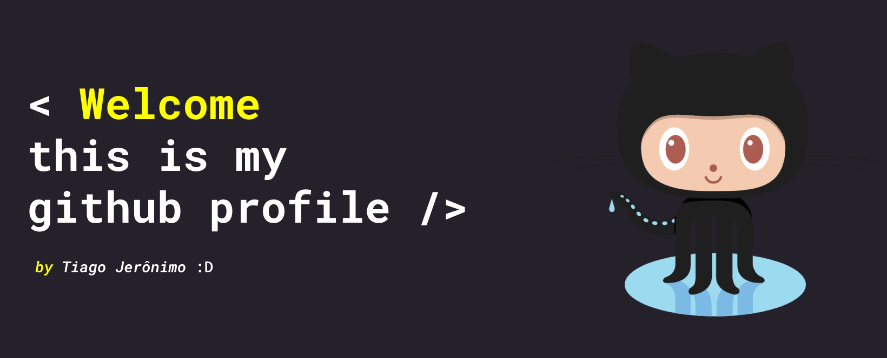

  <h1><strong>Hello, world! 👋 I'm Tiago Jerônimo </strong></h1>

 
 
<h2> A little about myself </h2>
💡 Software development, Liturgy and reading.
  
🔭 I am currently studying to become a Full Stack Junior, see my progress in my study repository at the link below

 * [Click Here](https://github.com/tiago-jeronimo/trybe.exercicios)
 
 

  <a href="https://github.com/tiago-jeronimo">
  
  

